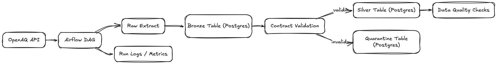

# Air Quality Monitoring Data Platform

A data platform for aggregating and visualizing air quality metrics from multiple sources.  
Built to explore patterns in air pollution data and make it accessible for analysis.

## Overview

This project was created to combine data engineering, API integration, and visualization while working with real-world environmental data. Air quality data is fragmented across different sources and formats, and this platform aims to centralize it and make it easier to work with.

There is also anecdotal evidence that professional CS2 player Zywoo (Team Vitality) performs worse in highly polluted cities, which motivated an exploratory analysis using air quality data.

## Why This Matters

Beyond technical demonstration, this project explores questions I've faced in production:

- **Cost vs. Performance**: When is Databricks worth the premium over Athena?
- **Vendor Lock-in**: How do we balance convenience with portability?
- **Data Quality at Scale**: What validation patterns work for streaming vs batch?
- **Platform Thinking**: How do we make data accessible without creating a bottleneck?

## Project Evolution

- This project started as a local proof-of-concept and is being rebuilt as a production-style data platform. The initial approach used SQLite and Python scripts, but that did not reflect the reliability and operational patterns I wanted to practice.

## Current Scope (Phase 1)

This repository is currently focused on one golden pipeline path:

- OpenAQ ingestion with Airflow orchestration
- Contract-driven validation and normalization
- Bronze/silver layers with idempotent reruns
- Operational logging and basic quality checks

This scope is intentional. The goal is to deliver one end-to-end path with reliable behavior before adding more platform surfaces.

## Architecture

The platform follows a modern data stack approach, using managed services where appropriate while keeping infrastructure decisions explicit.

### Phase 1 (Current)

The current implementation centers on a single Airflow-driven ingestion path with a strict data contract, idempotent processing behavior, and local-first operability.



### Phase 2+ (Planned)

After Phase 1 is stable, the project expands to:

1. **Databricks path**: Delta processing and governance comparisons.
2. **AWS native path**: Athena + Iceberg modeling and performance/cost analysis.
3. **Serving layer expansion**: API and BI consumers backed by curated datasets.


## Why This Architecture?

I chose a phased architecture because this is the most practical way to balance depth and breadth:

- ship one reliable pipeline first (contract, reruns, observability),
- then add comparative platform paths with measurable tradeoffs.

The longer-term split between Databricks and AWS services reflects a common pattern I've seen in production: centralized platform standards with selective AWS-native workloads where that fit is better.

## Tech Stack

### Infrastructure & Orchestration
- **Airflow**: Current orchestration backbone for the golden pipeline.
- **Terraform**: Infrastructure as code baseline for reproducibility.
- **AWS / Databricks**: Planned expansion for cross-platform benchmarking and governance patterns.

### Data Processing & Storage
- **Contract-first ingestion**: Required fields, type normalization, and explicit invalid-record handling.
- **Bronze/Silver design**: Raw traceability + normalized queryable layer with idempotent reruns.
- **dbt / Iceberg / Delta**: Planned for later phases once the golden path is stable.

### Serving & Visualization
- **FastAPI / Metabase / Databricks SQL**: Planned serving surfaces after core pipeline hardening.

## Getting Started
### 1. Create your local environment file
```bash
cp .env.example .env
```

Update `.env` with non-default passwords before running Airflow locally.

### 2. Initialize Airflow metadata DB and admin user
```bash
poetry run task init-airflow
```

### 3. Start local services
```bash
poetry run task airflow-local
```

## Documentation
Architecture decisions are tracked in ADRs:

- `docs/architecture/adr-001-scope-freeze-and-golden-path.md`
- `docs/architecture/adr-002-golden-dag-contract-and-idempotency.md`

## Contributing
This is a personal project but feedback is welcome


## License
[MIT]
