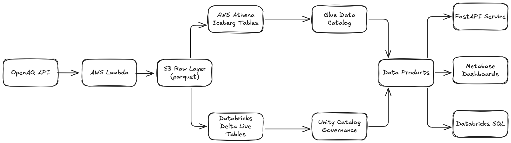

# Air Quality Monitoring Data Platform

A data platform for aggregating and visualizing air quality metrics from multiple sources.  
Built to explore patterns in air pollution data and make it accessible for analysis.

## Overview

This project was created to combine data engineering, API integration, and visualization while working with real-world environmental data. Air quality data is fragmented across different sources and formats, and this platform aims to centralize it and make it easier to work with.

There is also anecdotal evidence that professional CS2 player Zywoo (Team Vitality) performs worse in highly polluted cities, which motivated an exploratory analysis using air quality data.

## Project Evolution

- This project started as a local proof-of-concept but quickly evolvido into a cloud-native platform. The initial approach used SQLite and Python scripts, but doesn't really reflect the kind of systems I've been working with.

## Architecture

- The platform follows a modern data stack approach, using. managed services where appropriate while maintaining control over infrastructure through code.

## Why This Architecture?

I chose a dual-path approach (Databricks + AWS native) for a few reasons.

The split between Databricks and AWS services reflects a common pattern I've seen: companies standardizing on Databricks for core data engineering while maintaining some AWS-native pipelines for specific use cases.

## Tech Stack

**Infrastructure & Operations**

- Terraform: For reproducible, version-controlled infrastructure
- AWS: S3 for storage, Lambda for serverless ingestion, Glue for catalog
- Databricks: Specifically Unity Catalog for governance and Delta Lake for storage
- Airflow (Will probably set up Prefect on the side for the sake of comparison)
- Docker: Containerizing services for consistency

**Data Engineering**

- Apache Iceberg: Using this via AWS Athena to compare against Delta Lake
- dbt: For SQL-based transformations alongside Spark jobs
- Python: Primary language for pipelines and scripts

**Serving & Visualization**

- Metabase: Open-source BI tool that's easy to deploy
- FastAPI: For any API endpoints exposing data
- Databricks SQL: For ad-hoc analysis and some dashboards

## Getting Started
(WIP)

## Documentation
I'll update architecture decision records (ADRs) in the docs/ directory to explain key choices. These are written as if for a team, explaining the context, decision, and consequences.

## Contributing
This is a personal project but feedback is welcome
